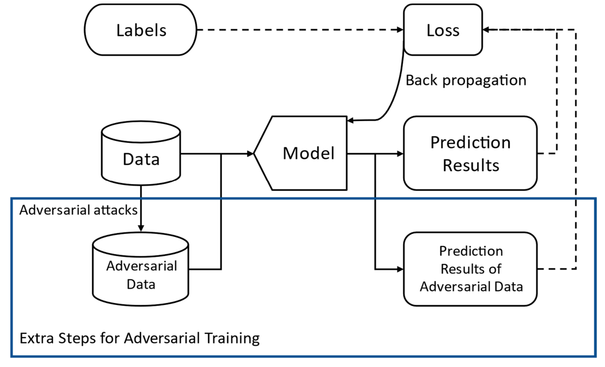

# Adversarial Training Demo
Simple demo for learning adversarial training.

> **Requirements**
>
> This project is based on *Python 3.13*, and [PyTorch](https://pytorch.org) is adopted as the AI framework. By default,
> the **CPU version** of PyTorch is downloaded as a dependency by [uv](https://uv-project.org).
>
> If you prefer `pip` as your package manager, please see the [Build with pip](#build-with-pip) section.

- [Adversarial Training Demo](#adversarial-training-demo)
  - [Project structure](#project-structure)
  - [Principle](#principle)
  - [Build system](#build-system)
  - [Build with pip](#build-with-pip)

## Project structure
This project consists of several major parts:


| Module   | Description                                                                   |
| -------- | ----------------------------------------------------------------------------- |
| Datasets | Objects that provide two `DataLoader`s for training and testing respectively. |
| Attacks  | Make perturbations to tensors in order to make models misjudge.               |
| Models   | Receives an image tensor and returns an one-hot tensor.                       |

## Principle

The adversarial training method was proposed in the paper [Towards Deep Learning Models Resistant to Adversarial Attacks
](https://arxiv.org/abs/1706.06083). Formally, this method is a solution to the optimization problem below:

$$
\min_{\theta} \rho(\theta), \quad \text{where}\ \rho(\theta)=\mathbb E_{(x,y)\sim\mathcal D}\left[\max_{\delta\in\mathcal S}L(\theta,x+\delta,y)\right]
$$

Illustrated by another paper [Adversarial Training Methods for Deep Learning: A Systematic
Review](https://www.mdpi.com/1999-4893/15/8/283), the routine of adversarial training method is:



which is quite simple in code.

## Build system
This project adopts [uv](https://docs.astral.sh/uv) as build system. Modern build systems (like uv) are preferred over vanilla `pip` tool, because uv handles virtual environment & package management automatically and correctly.

> For example, the vanilla `pip` tool **won't remove indirectly referenced dependencies** when removing the direct ones. When installing `torchvision`, pip will install `pillow` and other packages required by `torchvision`, but will leave them unchanged when `torchvision` is removed.

To install & use uv, see [the official installation guide](https://docs.astral.sh/uv/getting-started/installation/).

## Build with pip
For compatibility, a `requirements.txt` file is provided along with the modern python package config file (`pyproject.toml`). To perform vanilla installation of dependencies, run:

```shell
pip install -r requirements.txt
```

> **NOTE**: This `requirements.txt` is automatically generated by uv using `uv export` command. No guarantee is made when it comes to full `pip` compatibility.

Virtual environments are recommended in case to keep the global Python environment clean.